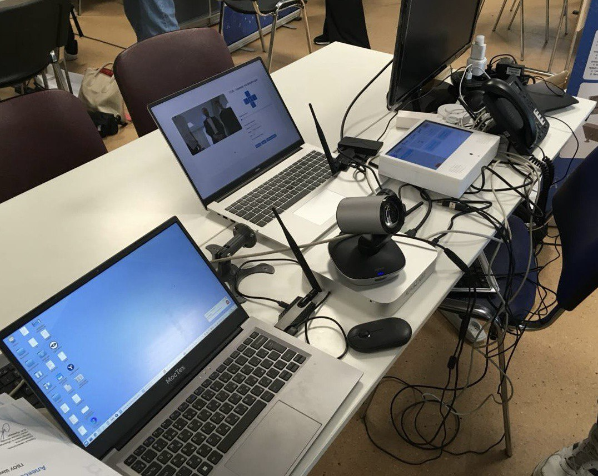
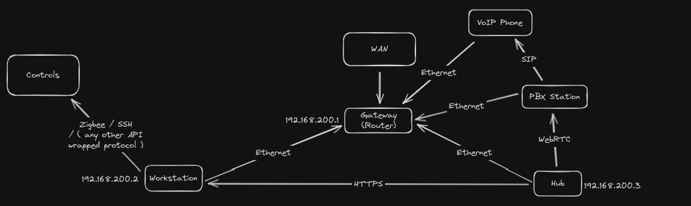

# About SmartCab

SmartCab is a project providing smart infrastracture for convenient automation of the device interaction within a cabinet of an educational institution.

SmartCab Infrastructure consists of several devices tied within a common network:
- *Controls*. Cabinet automation devices, such as PCs, sockets, lighting ones, VoIP phones and others. Normally, every control device's implemented over a protcol used for communicating with it, e. g. Zigbee, SSH, SIP.
- *Workstation Machine*. A dedicated machine with enough resources to run all the major services of the project.
- *The Hub*. A sensor-control tablet providing frontend interface for convenient and flexible interaction with the controls and other user-needed services. Usually, a Raspberry Pi with a display, a microphone and speakers connected, packed into specifically modeled and printed plastic box. If the tablet's machine has enough resources and power to run all the project's major services, it can be both the Hub and the Workstation as one machine.
- *Conference Camera Toolkit devices*. ConfCam Toolkit is a big separate project providing its own minor services running alongside SmartCab ones. See the provided [readme](https://github.com/smart-cab/conference-camera).

This repo provides major backend and frontend services controlling the whole SmartCab's device infrastructure. These are very heavy ones and should run on the dedicated workstation machine.

## Setting up the infrastructure

### Devices

#### Workstation setup

Hardware requirements: 8GB RAM, 2.4Ghz.

Preparation:
1. Install any debian-based linux distribution and connect it to the network
2. Connect zigbee adapter and confcam-related stuff

#### Hub setup

Hardware requirements: 1GB RAM, 2.4Ghz.

Preparation: install Raspbian Lite OS using [Raspberry Pi Imager](https://www.raspberrypi.com/software/) and connect raspberry to the network.

#### MikoPBX station setup

1. Setup MikoPBX according to [the official guide](https://wiki.mikopbx.ru/setup).
2. Setup WebRTC SIMPL5 client according to [the instruction](https://wiki.mikopbx.ru/faq:webrtc).
3. Obtain pbx station ip, call number and password of the client

### Result

Complete infrastracture setup will look like this:

### Network

See short network overview:

It's **essential** to fixate workstation, hub and pbx station ip adresses according to device MAC addresses within router settings. It's **not essential** to have workstation, hub and pbx station connected via Ethernet, but recommended, as as far as possible wire-linked networks are more stable as a rule.

### Deployment

After all the defined preparations and setups, use the [SmartCab Deployment Toolkit](https://github.com/smart-cab/smartcab-deployment-toolkit) to deploy hub and workstation services on the specified machines. See the readme provided.

## Setting up the development environment

Just clone this repo and run docker services with `docker compose up` command. It's not essential to append `--build` flag to the command unless you do some major change to the e. g. package dependencies as hot-reloading is configured.

## License

[MIT](./LICENSE)
